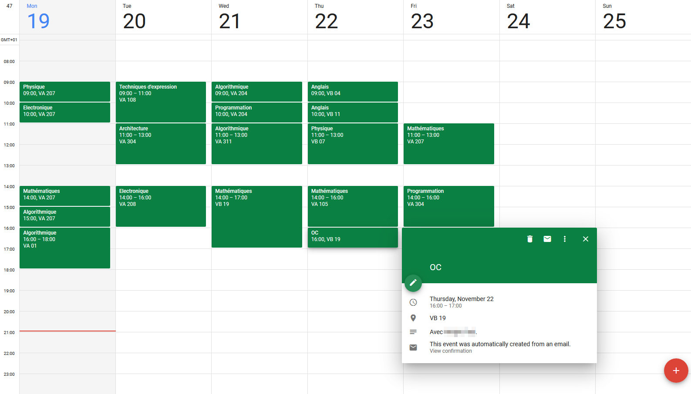

chronos-to-gcalendar
====================

A simple Python script that automatically uploads a IONIS student's schedule
to a Google Calendar, using [ChronosQL](https://github.com/71/chronos-ql).


## Getting started

### 1. Install requirements
```bash
pip install -r requirements.txt
```

### 2. Set up authentication
- Follow [this guide](https://developers.google.com/calendar/quickstart/python)
  to get a `credentials.json` file, and put said file in this directory.
- The first time this app is launched **only**, it will open a browser window
  and ask you to authorize access to your Google Calendar. Please grant
  the access. A `token.json` file will be created.

### 3. Create a wrapper script
For instance, create a file `launch.py` in this directory, with for content:

```python
from datetime import date, timedelta
from upload   import connect_calendar, upload_schedule

# Enter your calendar ID, visible on https://calendar.google.com/calendar
# > Calendar > Settings and Sharing > Calendar ID
#
# 'primary' can also be used to upload your courses to your main calendar.
CALENDAR_ID = '<calendar id>'

# Enter your IONIS group, for instance 'INFOS1INT1-1'.
GROUP = '<group>'

# Perform login...
service = connect_calendar()

# Upload everything!
#
# Here, a few optional arguments are provided:
#
# - 'start' is the date at which we should start looking for courses.
#   By default, this is the current date.
#
# - 'end' is the date at which we should stop looking for courses.
#   By default, this is the start date plus 14 days.
#
# - 'filter_course' is a predicate that decides whether a course
#   should be ignored.
#   In this example, all classes that start with the name 'Soutien' are ignored.
upload_schedule(service, CALENDAR_ID, GROUP,
  start         = date.today(),
  end           = date.today() + timedelta(days=7),
  filter_course = lambda x: not x['name'].startswith('Soutien'))
```

### 4. Run the script and let the magic happen
```bash
python launch.py
```


